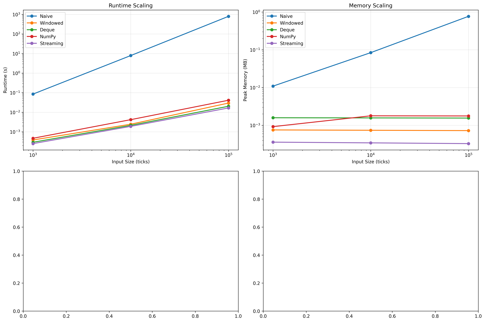

# High-Performance Streaming Data Architectures: A Complexity Analysis

This repository demonstrates the optimization of algorithmic time and space complexity when processing massive, high-frequency continuous data streams. 

While the underlying algorithm is a financial Moving Average calculation, the architectural concepts applied here—constant-time execution, branchless programming, memory-safe data ingestion, and precision drift mitigation—are directly applicable to processing high-frequency sensor telemetry, autonomous vehicle data pipelines, and real-time analytics.

## 🚀 Key Engineering Achievements

1. **O(1) Data Pipeline Space Complexity**: Overhauled the standard, memory-heavy CSV ingestion process (`list` array loading) by implementing a strict Python generator architecture. This drops the memory footprint to near-zero and allows for infinite runtime on unbounded data streams without risking Out-of-Memory (OOM) faults.
2. **Branchless C-Level Execution**: Transitioned a naive **O(N²)** Python algorithm into a true **O(1)** per-tick highly optimized NumPy circular buffer, leveraging bitwise/modulo operations to avoid CPU branch prediction penalties.
3. **Floating-Point Drift Mitigation**: Implemented periodic re-synchronization within running-sum algorithms to prevent microscopic float-precision accumulation errors over millions of cycles.

## 📂 Architecture & Files

* **`data_loader.py`**: A highly optimized generator-based data ingestion pipeline designed for strict O(1) space complexity.
* **`strategies.py`**: Contains the algorithmic progression of the moving average logic:
  * `NaiveMovingAverageStrategy`: The baseline (O(n²) time, O(n) space).
  * `WindowedMovingAverageStrategy`: List-based running sum with hidden O(k) memory-shifting overhead.
  * `DequeNaiveStrategy`: Doubly-linked list approach for true O(1) memory management.
  * `NumPyVectorizedStrategy`: High-performance circular buffer array.
  * `StreamingStrategy`: Exponential Moving Average requiring zero buffer state (O(1) space/time).
* **`profiler.py`**: Benchmarks execution time (`time.perf_counter`) and peak RAM usage (`tracemalloc`), and plots log-log scaling charts to mathematically prove Big-O complexity.
* **`main.py`**: The central orchestrator that streams the data and executes the profilers.
* **`reporting.py`**: Auto-generates the `complexity_report.md` file detailing architectural tradeoffs.

## 📈 Performance Results

By benchmarking dataset limits from 1K to 100K continuous ticks, we proved the theoretical Big-O complexities against real hardware execution:


*(Log-log axes. A slope of 1 indicates linear O(n) scaling; a slope of 2 indicates quadratic O(n²) scaling).*

* **The Naive Approach** suffered a severe runtime explosion (+4000x execution time) and linear RAM growth, failing to scale.
* **The Optimized Architectures** (NumPy and Streaming) flatlined memory consumption and maintained strict constant-time execution speeds regardless of dataset size.

For a full technical breakdown of the algorithm architectures, please see the autogenerated [Complexity Analysis Report](complexity_report.md).

## ⚙️ How to Run

Clone the repository and run the main orchestrator to stream the data, benchmark the strategies, and generate the analytical reports automatically:

```bash
python main.py